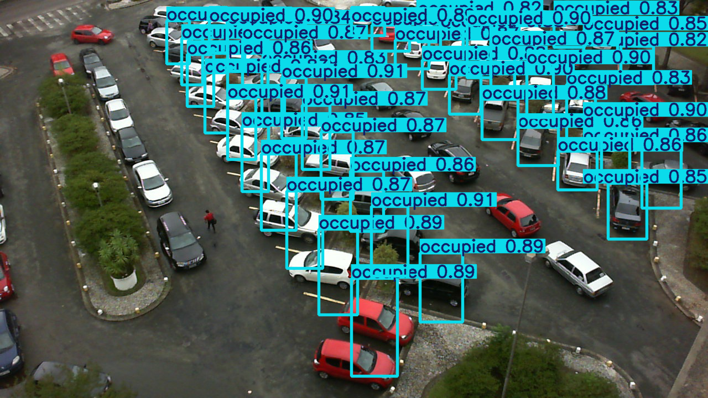

# 🅿️ Smart Parking Detection System – AI-Powered Parking Occupancy Predictor

A deep learning–based **Smart Parking System** built using **TensorFlow**, **Keras**, and the PKLot dataset. This project predicts whether a parking space is **occupied** or **empty** using a CNN-based image classifier — now enhanced with a **real-time video-based detection module** using **OpenCV**, enabling live monitoring through video streams or CCTV feeds.


> ⚠️ *This is a demo/portfolio project created for learning and academic purposes. Dataset credits belong to UFPR's PKLot project.*


## 🔍 Key Features

✅ Uses real-world parking lot images from the PKLot dataset  
✅ Binary image classification using a CNN model  
✅ Image preprocessing, normalization, and augmentation
✅ Real-time parking detection from live video / webcam / CCTV feed 
✅ Evaluation with confusion matrix and test accuracy  
✅ Clean and modular code via Jupyter Notebook  
✅ Future-ready for real-time camera input integration  


## 🛠 Tech Stack

| Layer         | Technology Used                |
|---------------|--------------------------------|
| **Modeling**  | TensorFlow, Keras              |
| **Scripting** | Python, Jupyter Notebook       |
| **Data**      | PKLot Dataset (Segmented)      |
| **Visualization** | Matplotlib, Seaborn       |
| **Evaluation**| Scikit-learn                   |
| **Real-time Inference** | OpenCV + Trained CNN Model |


## 📁 Project Structure

```plaintext
smart-parking/
├── PKLot/                   # Original dataset with raw images
├── PKLotSegmented/         # Segmented parking spots (used for training)
├── PklotInfo.pdf           # Dataset description and methodology
├── parking-lot-prediction.ipynb  # Model development notebook
├── frontend                   # React based frontend
├── README.md               # Project documentation
└── requirements.txt        # Dependencies (to be generated)
````


## 🚀 Getting Started

### Prerequisites

* Python 3.7+
* Jupyter Notebook
* pip (Python package manager)

### Installation Steps

```bash
# Clone the repository
git clone https://github.com/samdisha-walia/Smart-Parking.git

# Navigate into the project folder
cd smart-parking

# (Optional) Create and activate a virtual environment
python -m venv venv
source venv/bin/activate  # on Unix
venv\Scripts\activate     # on Windows

# Start Jupyter Notebook
jupyter notebook parking-lot-prediction.ipynb
```

## 📊 Model Workflow

### 🧹 Preprocessing

* Load images from `PKLotSegmented`
* Resize images (typically to 54×32 or similar)
* Normalize pixel values
* Split into train/test sets

### 🧠 Model Architecture

* 3 Conv2D + MaxPooling layers
* Dense layers with Dropout
* Sigmoid output for binary classification

### 📈 Evaluation

* Accuracy, precision, recall
* Confusion matrix
* Visual prediction examples

## 📷 Sample Result



## 🌱 Future Enhancements

* 📹 Real-time detection using OpenCV and live camera input
* ☁️ Deploy the model with Flask or FastAPI
* 📦 Create Docker image for easier deployment
* 📱 Build a mobile/web dashboard to show parking availability

## 👤 Author

**Samdisha Walia**
[GitHub](https://github.com/samdisha-walia) • [LinkedIn](https://linkedin.com/in/samdisha-walia)

## 🌟 Support This Project

If you found this project interesting or useful, please consider giving it a ⭐️ on GitHub. It helps a lot!

> 📝 *Inspired by real-world smart parking systems. Created for educational use only.*

